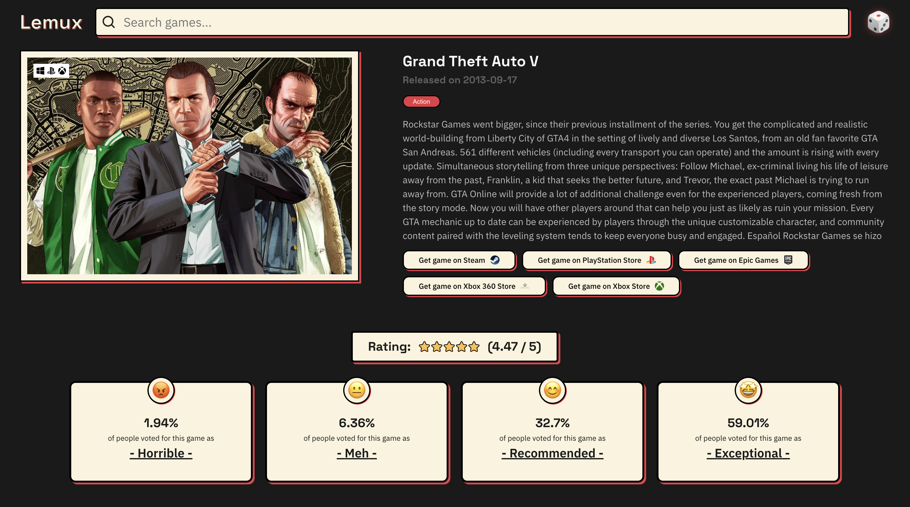
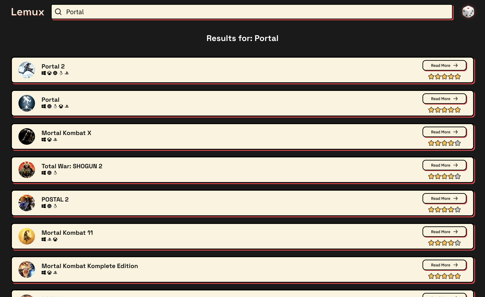

# 🎮 Lemux - The Video Game Library

A sleek React web app for exploring video games using the [RAWG Video Games Database API](https://rawg.io/apidocs). Search, discover, and browse games with details, ratings, trailers, and store links — all in a modern, responsive UI inspired by Neubrutalism style.

<button style='background-color: #faf3dd; border: 2px solid black; border-radius: 5px; padding:5px 15px; box-shadow: 1px 1px 0 #e63946' onclick="window.location.href='https://chic-centaur-fa51d2.netlify.app/'">
  See the project
</button>

## ✨ Features

- 🔍 **Search Games** by title using an intuitive search bar.
- 📊 **Game Details** including description, genres, ratings, platforms, and publishers.
- 🎞 **Trailers Carousel** with thumbnail previews and horizontal scroll.
- 🏪 **Store Links** to purchase games from platforms like Steam, Epic Games, and more.
- 🎲 **Random Game Dice** to discover something new with one click.

## 🛠 Technologies

- [React](https://reactjs.org/)
- [React Router](https://reactrouter.com/)
- [RAWG API](https://rawg.io/apidocs)
- Custom components (`SearchBar`, `Button`, `TagBox`, `RatingStars`, etc.)

## 🚀 Getting Started

### Prerequisites

- Node.js & npm

### Installation

```bash
git clone https://github.com/lidor-cohen/lemux.git
cd lemux
npm install
```

### Start Development Server

```bash
npm run dev
```

## 🔑 API Key Setup

The app uses the RAWG API which requires an API key.

1. Sign up or log in at [RAWG.io](https://rawg.io/apidocs)
2. Get your **API key**
3. Create a `.env` file in the root directory:

```env
VITE_RAWG_API_KEY=your_api_key_here
```

Make sure your API utility (`rawgApi.js`) uses the environment variable correctly:

```js
const API_KEY = import.meta.env.VITE_RAWG_API_KEY;
```

## 📸 Screenshots

Here are some visuals from the app:

### Homepage


### Game Detail Page



### Search Results Page



## 💬 Credits

- Game data & media provided by [RAWG Video Games Database API](https://rawg.io/apidocs)
